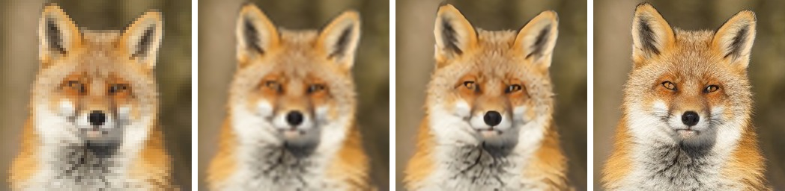

# BasicVSRRunner

[BasicVSR++](https://github.com/ckkelvinchan/BasicVSR_PlusPlus) (REDS4) on Lava:
4x upscaling of a short clip, each frame aligned against its neighbours through
optical flow and deformable convolution. Apache-2.0.

## Upscaling a clip

```julia
using BasicVSRRunner
import KernelAbstractions as KA

m  = basicvsrppmodel()
lq = zeros(Float32, 64, 64, 3, 5, 1)   # (W, H, RGB, T, 1) in [0, 1]
hr = upscale(m, lq)                    # (256, 256, 3, 5, 1) on the device
KA.synchronize(m.backend)
```

The export is static: five 64x64 frames. Another clip length or frame size is a
re-export (`tools/export_basicvsrpp.py --frames T --size S`), not an argument.
The output is not clamped; the model overshoots edges slightly.

**The degradation matters.** REDS4's low-resolution frames are MATLAB
`imresize(x, 1/4, 'bicubic')`, and that is what the model learned to invert.
Frames reduced another way, an area mean for example, come back with ringing and
vertical streaks. The example has a `bicubicdown` that matches the training data.

## Examples

Five 256x256 windows of the fox, 3 px apart, reduced to 64x64 and upscaled back:
[`docs/examples/basicvsr.jl`](../docs/examples/basicvsr.jl).



The middle frame at 64x64 (shown with nearest neighbour), bicubic, BasicVSR++,
and the original. **138 ms** for the five frames on a Radeon 8060S (RADV,
2026-09-30).

The output matches upstream's model files, run with the same weights, to 1.1e-5
(max abs over all five 256x256 frames of that clip); `test/runtests.jl` pins it
on a synthetic clip against values written by `tools/verify_basicvsrpp.py`.

## Assets

One artifact, `basicvsrpp` (26 MB, fp32).
