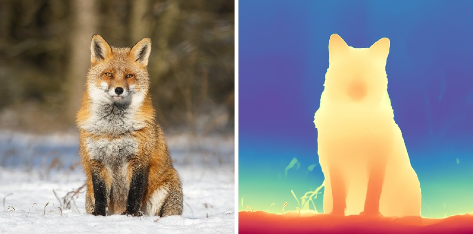

# DepthAnythingRunner

[Depth Anything V2](https://github.com/DepthAnything/Depth-Anything-V2) Small
(25M parameters) on Lava: monocular depth from one picture. Apache-2.0, which
only the Small checkpoint is; Base and Large are CC-BY-NC-4.0.

## Depth of a picture

```julia
using DepthAnythingRunner, FileIO
import KernelAbstractions as KA

m   = depthanything()                      # backend = Mantle.defaultbackend()
img = permutedims(load("harbor.jpg"))      # (W, H), any AbstractRGB, host or device
d   = depthmap!(m, img)                    # (518, 518, 1, 1) Float16, on the device
KA.synchronize(m.backend)
depth = Float32.(Array(d)[:, :, 1, 1])
```

The frame is squashed to 518x518 (not letterboxed) and ImageNet-normalized on the
device. The output is **inverse relative depth**: larger is nearer, and there is
no metric scale and no fixed range, so normalize it for display. It is not
resampled back to the frame; `GPUFiltering.bilinearresize!` does that. The
output buffer belongs to the model and the next call overwrites it.

## Examples

[`docs/examples/depthanything.jl`](../docs/examples/depthanything.jl), in the
colour map upstream's demo uses (Spectral reversed: red is near).




**19 to 23 ms** a frame on a Radeon 8060S (RADV, 2026-09-30), upload and resize
included. The map matches PyTorch to 4.2e-5 (`tools/verify_depthanything.jl`).

## Assets

One artifact, `depthanything` (95 MB): the graph and the weights.
