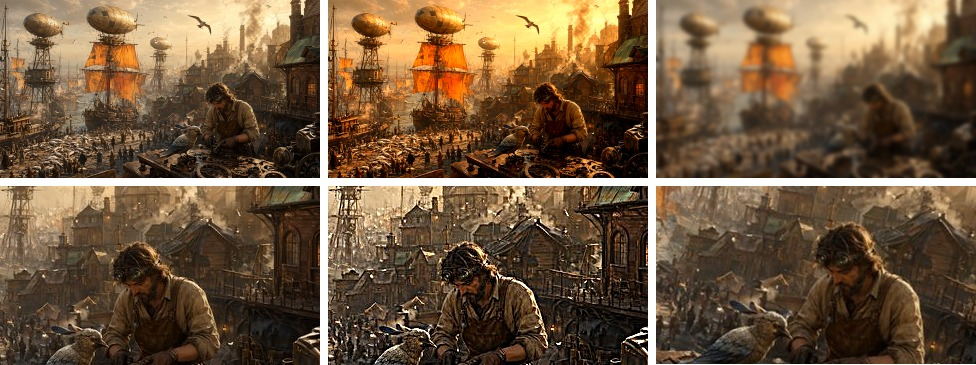

# GPUFiltering.jl

Backend-agnostic GPU image processing on [KernelAbstractions](https://github.com/JuliaGPU/KernelAbstractions.jl):
every function works on `AbstractMatrix{<:AbstractRGB}` (or `Float32`
matrices for the flow module) of **any** KA backend — `Matrix` (CPU),
`LavaArray` (Vulkan), `CuArray`, … — dispatching kernels via
`KernelAbstractions.get_backend(img)`. Born as the processing core of
VideoEditor.jl; usable standalone.

Kernels are asynchronous — call `KernelAbstractions.synchronize(backend)`
(or fetch with `Array`) before reading results on the host.

Images use `(width, height)` layout (x-contiguous), matching GLMakie.

## Examples

Every kernel below ran on the Vulkan device through Lava:
[`docs/examples/gpufiltering.jl`](../docs/examples/gpufiltering.jl).



Top: the Qwen-Image harbor, `coloradjust!` (contrast 1.15, saturation 1.4,
temperature 0.3), `gaussianblur!` at σ = 4. Bottom: a 1:1 crop before and after
`unsharpmask!` (σ = 2, amount 1.5), and `warp!` through `fitmatrix` with a
crop, a 1.2 zoom and a 12 degree turn.


The harbor turned 3 degrees and zoomed 6%, its dense `opticalflow!` against the
original (hue is direction, saturation length), and the frame warped back by the
affine `fitaffine` fits to that flow. The flow takes **4.7 ms** at 640x357 with
four pyramid levels on a Radeon 8060S (RADV, 2026-09-30).

## Color

```julia
coloradjust!(img; brightness=0, contrast=1, saturation=1, temperature=0)
coloradjust!(img, adj::ColorAdjustments)   # in-place, fused, no-op when neutral
channellinear!(img, gain::Vec3f, offset::Vec3f)
means, stds = channelstats(img)            # per-channel statistics
```

## Blur / sharpen

```julia
gaussianblur!(out, img, σ; tmp = similar(img))   # separable, replicate borders
unsharpmask!(out, img, σ, amount; tmp = similar(img))
```

Both take `weights`, a device vector of `gaussianweights(σ)` the caller owns:
inside a render graph that saves the upload, and with it a `vkQueueSubmit`, per
blur per frame.

## Geometry

```julia
warp!(out, img, M::Mat3f)     # bicubic (Catmull-Rom) PROJECTIVE warp: out[p] = img[proj(M*(p,1))]
warp!(out, img, crop)         # normalized (x, y, w, h) crop + resize in one pass
cropmatrix(crop, insize, outsize)
translationmatrix(dx, dy)     # sampling matrix that shifts CONTENT by (dx, dy)
```

`M` is a **sampling** matrix: it maps output pixels to input positions,
so shifting content right means sampling further left. `out` and `img`
may differ in size; the bottom row enables perspective (divide by w). A sample
outside the source replicates its edge, however far outside, and so does one
where `w` reaches zero. `fitmatrix(crop, insize, outsize; scale, position,
rotation)` places a crop without distorting it; `skipoutside = true` leaves the
letterbox pixels alone.

## Optical flow & global motion (FOLKI-style dense pyramidal LK)

```julia
ws = FlowWorkspace(backend, size(i1); levels=3)   # preallocate once,
opticalflow!(ws, u, v, i1, i2)                    # reuse across frame pairs
flowwarp!(out, img, u, v)                         # out[p] = img[p + (u[p], v[p])]
T = fitaffine(u, v)                               # robust global affine
T = fithomography(u, v)                           # + perspective terms
grayscale!(dest, rgbimg); bilinearresize!(dest, src)
```

**Sign convention** (enforced by tests): `i2[p + u(p)] ≈ i1[p]`, i.e. `u`
IS the content motion from `i1` to `i2`; `flowwarp!` by `u` displaces
content by `−u`.

**Fit convention**: both fits return the **align-back** sampling matrix —
`T*(x, y, 1) ≈ (x + u, y + v, 1)` (projectively for the homography), so
`warp!(out, i2, T)` aligns frame 2 back onto frame 1. If the content was
transformed by `S`, the fit recovers `inv(S)`. Robustness: median-translation
bootstrap followed by iterated trimmed least squares (survives a ~25 %
spatially-coherent moving subject); both fits use accumulated normal
equations — no allocation or LAPACK calls per solve, safe to run per frame
under CPU load. `fithomography` degenerates to zero perspective terms on
affine flow.

## GPU notes

- `RGB{N0f8}` construction goes through an unchecked `reinterpret`
  specialization of `topixel` — ColorTypes' checked path string-formats in
  its throw branch, which cannot compile to GPU code.
- `FlowWorkspace` exists because a bare `opticalflow!` call allocates ~15
  intermediates per pyramid level; reusing one workspace across a video
  analysis is both allocation-free and ~50 % faster on the CPU.

## Tests

`]test GPUFiltering`: 70 tests, all on the CPU. Bit comparisons against
ImageFiltering, flow sign and sub-pixel accuracy, fit recovery, robustness and
the inverse convention, end-to-end warp, flow, fit and restore round trips, and
warps whose sample positions leave the Int32 range or divide by zero.
