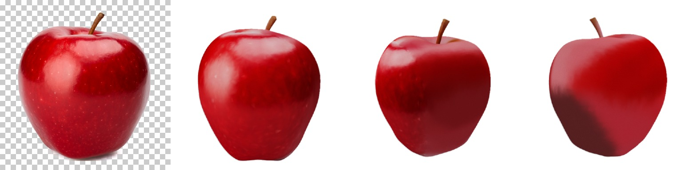

# Hunyuan3DRunner

[Hunyuan3D-2.1](https://github.com/Tencent-Hunyuan/Hunyuan3D-2.1)'s shape branch
on Lava: one RGBA cut-out in, a watertight triangle mesh out. **Non-commercial**
(Tencent Hunyuan Non-Commercial License).

## A mesh from a picture

```julia
using Hunyuan3DRunner

m = hunyuan3d()                                   # first use downloads ~6.8 GB
v, f = imagetomesh(m, rgba; steps = 50, guidance = 5.0, octree = 384,
                   progress = (k, n) -> println(k, "/", n))
v, f = removefloaters(v, f)
v, f = removedegenerate(v, f)
v, f = decimate(v, f; maxfaces = 40_000)
writeobj("apple.obj", v, f)
```

`rgba` is `(W, H, 4)` `UInt8`, width first, with a real alpha channel: there is
no background removal here, so bring a cut-out (SAM 2, or Qwen-Image's own
alpha). Vertices come back `(3, V)` Float32 in `[-1.01, 1.01)`, faces `(3, F)`
Int32, 1-based and wound outward. `latents` makes a run reproducible;
by default they are drawn from the global RNG.

The stages are public too: `prepareimage`, `encodeimage`, `denoise`,
`shapelatents`, `occupancy`; the extraction is `GPUMeshing.marchingcubes`.

This is the shape only. The texture branch (`hunyuan3d-paintpbr-v2-1`) is not
ported; `tools/project_texture.jl` is the stopgap, projecting the picture the
shape came from back onto it and filling the rest from its edges.

## Examples

The Qwen-Image apple, whose alpha is the model's own, as a mesh, coloured by
`tools/project_texture.jl` and path traced with RayMakie:
[`docs/examples/hunyuan3d.jl`](../docs/examples/hunyuan3d.jl).



The input, the side the picture saw, and two the model invented. **422 s** from
picture to mesh on a Radeon 8060S (RADV, 2026-09-30), at the defaults: 50
denoiser steps and a 384³ octree, which gave 1,139,056 faces before decimation to
40,000. On an RTX 4000 Ada it measured 188.6 s: 100 s in the denoiser, 88 s in
the geometry decoder.

`decimate` is the quadric edge collapse upstream runs through `pymeshlab`, with
the same three constraints (topology, normals, boundary), though not
bit-identical to vcglib's: 692,956 faces to 40,000 in 2.2 s against 5.99 s, at a
mean surface distance of 2.0e-5 against 9.1e-5.

## Assets

Eight artifacts, 6.9 GB together, all downloaded on first use:

| artifact | size | |
|---|---|---|
| `hunyuan3d` | 0.9 MB | the DiT graph |
| `hunyuan3d-dit-w1` … `-w4` | 5.9 GB | its fp16 weights, in four parts for GitHub's 2 GiB asset limit |
| `hunyuan3d-cond` | 581 MB | the DINOv2 conditioner |
| `hunyuan3d-vae` | 385 MB | the shape VAE |
| `hunyuan3d-geo` | 25 MB | the geometry decoder |

`Hunyuan3DRunner.ready()` checks for them without downloading.
