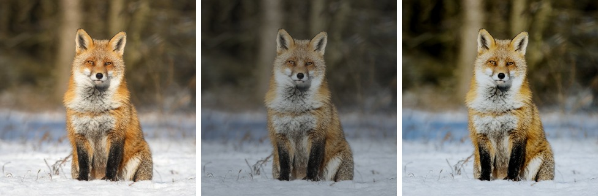

# NeuralLUTRunner

[Image-Adaptive 3D LUT](https://github.com/HuiZeng/Image-Adaptive-3DLUT) on
Lava: a CNN of under 600K parameters looks at a frame and predicts a 33³ colour
lookup table for it. Apache-2.0.

The network ends at the table, not at an image. The table is a grading object an
editor can hold, show, keyframe and push around, and applying it is
`GPUFiltering.lut3d!`, which does not care whether a network or a `.cube` file
made it.

## Grading a picture

```julia
using NeuralLUTRunner, ColorTypes
import KernelAbstractions as KA

m   = neurallut()
img = KA.allocate(m.backend, RGB{Float32}, W, H)   # (W, H) in [0, 1], on the device
copyto!(img, host)
out = similar(img)
lut = predictlut(m, img)        # (33, 33, 33, 3) Float32 on the device, [r, g, b, channel]
grade!(out, img, lut)           # or grade!(m, out, img) to predict and apply in one call
KA.synchronize(m.backend)
```

`predictlut` resizes the frame to 256x256 for the classifier, so it costs the
same at any resolution. The table it returns is the model's own output buffer:
copy it to keep it past the next call.

## Examples

The checkpoint is upstream's FiveK sRGB enhancer, trained to turn flat, dark
camera output into a retouched photo. So the Qwen-Image examples are first made
flat and cool with `coloradjust!` (brightness -0.15, contrast 0.7, saturation
0.7, temperature -0.3), and the predicted table has to undo that:
[`docs/examples/neurallut.jl`](../docs/examples/neurallut.jl).




Original, flattened, graded. Predicting and applying takes **3.7 ms** at 640x640
on a Radeon 8060S (RADV, 2026-09-30). The table matches PyTorch to 3.6e-7 and
the apply matches upstream's `trilinear_kernel.cu` to 3.0e-7
(`tools/verify_neurallut.jl`).

## Assets

One artifact, `neurallut` (2.3 MB).
