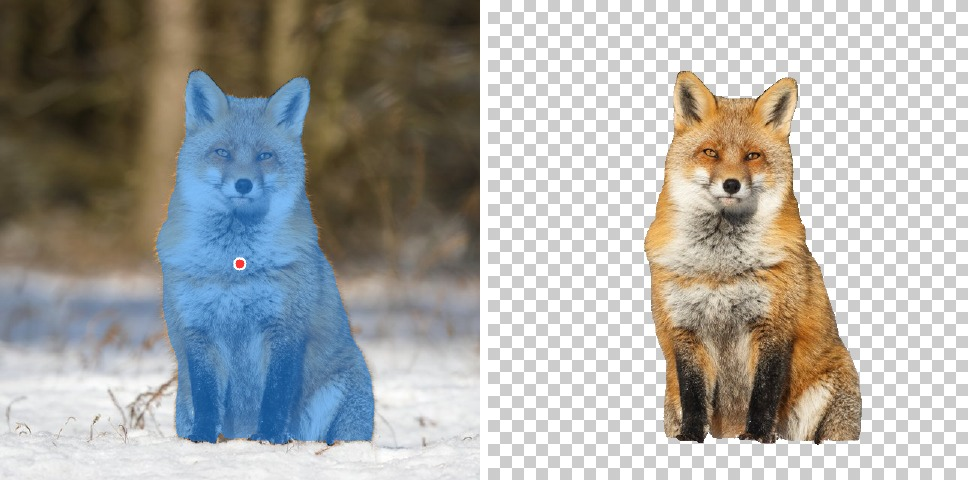
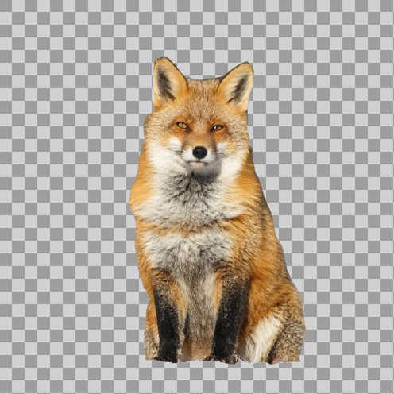
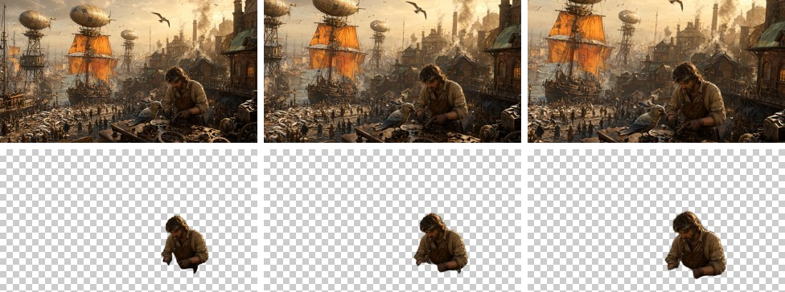

# JuliaVision

Neural networks and image kernels on the GPU, from Julia, through
[Lava](https://github.com/SimonDanisch/Lava.jl) and Mantle: one SPIR-V module per
kernel for every Vulkan driver, measured on NVIDIA and AMD. A graph runtime
for models exported from PyTorch, the image kernels around them, and one package
per model whose job is to have no cold start.

Every picture below was made by these packages on one Radeon 8060S, and the inputs
too: Qwen-Image drew them, and the other models took it from there.

<table>
<tr>
<td></td>
<td></td>
</tr>
<tr>
<td>Qwen-Image 2.1, from a prompt</td>
<td>SAM 2.1, one click</td>
</tr>
<tr>
<td></td>
<td></td>
</tr>
<tr>
<td>Qwen-Image 2.1, background removed from a reference image</td>
<td>Depth Anything V2</td>
</tr>
<tr>
<td colspan="2"></td>
</tr>
<tr>
<td colspan="2">Hunyuan3D-2.1, a mesh from the Qwen-Image apple, path traced with RayMakie</td>
</tr>
<tr>
<td colspan="2"></td>
</tr>
<tr>
<td colspan="2">SAM 2 marks the mechanic once, MatAnyone2 mattes him through the clip</td>
</tr>
</table>

## Packages

| package | what it does | the model's licence |
|---|---|---|
| [`DNNKernels`](DNNKernels/README.md) | the graph runtime: loads a `torch.export` graph, rewrites and fuses it, declares it to Mantle | (no model) |
| [`GPUFiltering`](GPUFiltering/README.md) | image kernels: colour, blur, warp, optical flow, patch tracking, LUTs | (no model) |
| [`GPUMeshing`](GPUMeshing/README.md) | volume to mesh: marching cubes and sparse dual contouring | (no model) |
| [`QwenImageRunner`](QwenImageRunner/README.md) | Qwen-Image 2.1: text to image with real alpha, up to 12 reference images | **non-commercial** (Qwen Research License) |
| [`SAM2Runner`](SAM2Runner/README.md) | SAM 2.1: click to segment | Apache-2.0 |
| [`MatAnyoneRunner`](MatAnyoneRunner/README.md) | MatAnyone2: carries a mask through a clip as an alpha matte | **non-commercial** |
| [`DepthAnythingRunner`](DepthAnythingRunner/README.md) | Depth Anything V2 Small: monocular depth | Apache-2.0 |
| [`NeuralLUTRunner`](NeuralLUTRunner/README.md) | Image-Adaptive 3D LUT: a colour grade predicted per frame | Apache-2.0 |
| [`RIFERunner`](RIFERunner/README.md) | RIFE 4.26: frame interpolation | MIT |
| [`BasicVSRRunner`](BasicVSRRunner/README.md) | BasicVSR++: 4x video upscaling | Apache-2.0 |
| [`Hunyuan3DRunner`](Hunyuan3DRunner/README.md) | Hunyuan3D-2.1 shape: a mesh from one picture | **non-commercial** |
| [`WhisperRunner`](WhisperRunner/README.md) | Whisper large-v3-turbo: speech to text | MIT |
| [`KokoroRunner`](KokoroRunner/README.md) | Kokoro-82M: text to speech, 54 voices | Apache-2.0 |
| [`BonsaiRunner`](BonsaiRunner/README.md) | Ternary Bonsai 2 27B: a language model in 1.58 bits | see upstream |
| [`HorizonRunner`](HorizonRunner/README.md) | K2 Horizon 32B: a language model, int8, local export only | Apache-2.0 |
| [`Trellis2Runner`](Trellis2Runner/README.md) | TRELLIS.2: image to textured mesh; ported, no published assets yet | see upstream |

Not ported yet, each a package that loads and precompiles with nothing to run:

| package | what it will do | what it waits for |
|---|---|---|
| `ProPainterRunner` | object removal in video (**non-commercial**) | flow-guided propagation, windowed temporal attention |
| `DemucsRunner` | stem separation | an on-device STFT inside the graph |
| `DeepFilterRunner` | voice denoising | the complex STFT front end, an ERB filterbank |
| `FluxKleinRunner` | generative fill and edits, FLUX.2-klein 4B | `group_norm`, a VAE decoder, a sampler loop |
| `ZImageRunner` | text to image, Z-Image-Turbo 6B | `group_norm`, a VAE decoder |
| `QwenImageEditRunner` | instruction edits, Qwen-Image-Edit-2511 | 57 GB of weights; an int4 dequant in the GEMM epilogue |

Four of these are audio models, and `JuliaVision` is not where a speech
recogniser belongs. Renaming is a separate job from porting.

The repository itself has no LICENSE file yet. The pictures on this page start
from Qwen-Image 2.1, whose licence is for non-commercial research use.

## Getting started

Clone this repository and [Lava](https://github.com/SimonDanisch/Lava.jl) and
`Pkg.develop` the packages you want into one environment; `[sources]` in each
`Project.toml` says where Lava lives, since it is not in the General registry.

```julia
using SAM2Runner, FileIO
img  = permutedims(load("fox.jpg"))                     # (W, H): x first
mask = segment(img, [(0.5, 0.55)])                      # one click, normalized
mask = segment(img, [(0.3, 0.4), (0.8, 0.9, false)])    # include, and exclude
```

Weights download on first use and are shared by every environment on the
machine; nothing is fetched at install time. Each package README has an example
and what it produced, and [`docs/examples/`](docs/examples) is the code that made
every picture here.

The whole thing as one site: `julia --project=<env> docs/make.jl` writes it to
`docs/build/` with [Bonito](https://github.com/SimonDanisch/Bonito.jl).

## On a Radeon 8060S, from the examples

One warm run each, 2026-09-30, RADV. These are what the examples took, not
benchmarks: no clock warming, no spread.

| model | work | time |
|---|---|---:|
| SAM 2.1 | encode and decode one click, 640x640 frame | 0.16 s |
| Depth Anything V2 S | one frame at 518² | 19 ms |
| Neural 3D LUT | predict and apply at 640x640 | 3.7 ms |
| GPUFiltering | optical flow at 640x357, four levels | 4.7 ms |
| RIFE 4.26 | one frame, padded to 1920x1152 | 0.26 s |
| MatAnyone2 | one frame at 640x368 | 113 ms |
| BasicVSR++ | five 64x64 frames to 256x256 | 138 ms |
| Hunyuan3D-2.1 | picture to mesh, 50 steps, 384³ octree | 422 s |
| Qwen-Image 2.1 | 1024x1024, 40 steps | 221 s |
| Kokoro-82M | 7.1 s of speech | 2.1 s |
| Whisper large-v3-turbo | a 7 s file, decode included | 1.0 s |
| Ternary Bonsai 2 27B | decode | 4.3 tokens/s |
| K2 Horizon 32B | prompt and decode | 4.4 tokens/s |

## Why the `*Runner` packages exist

They contain almost no code. Each one owns a `@compile_workload` that runs its
model for real during precompilation, so both halves of the cold start —
Julia's inference and the SPIR-V compile — are paid once at `Pkg.precompile`
instead of by whoever clicks first. Measured on SAM 2.1: 48.2 s to 3.3 s.

The split is not tidiness. A workload has to live *downstream* of everything it
uses, because loading a dependent package invalidates the caller's precompiled
code; putting the workload inside `DNNKernels` would make it depend on the
weights and cache nothing useful.

## Layout

Packages are plain subdirectories, [Makie](https://github.com/MakieOrg/Makie.jl)-style.
History for `DNNKernels` and `GPUFiltering` was carried over with `git subtree`,
so `git log --follow` still works through the move. A monorepo because these
change together: an op added to `DNNKernels` is usually a model that needed it.

## Speed against PyTorch, 2026-08-05

Measured 2026-08-05 on an **NVIDIA RTX 4000 Ada**, all in one sitting, before
DNNKernels declared its graphs to Mantle (2026-09-15); the rules below are the
lasting part. Ours
through `tools/bench_all.jl` (SAM 2's decode through `tools/bench_sam2.jl`),
PyTorch through `tools/baseline_*.py`. `±` is the sample spread the harness
reports; a row is only worth quoting when it is small.

| model | shape | Lava | PyTorch | ratio |
|---|---|---:|---:|---:|
| SAM 2.1 encode | 1024² | **102.9 ms** ±0.7% | 79.3 ms | 0.77x |
| SAM 2.1 decode | one click | **6.0 ms** | 1.76 ms | 0.29x |
| Whisper large-v3-turbo encode | 30 s window, fp16 | **120.5 ms** (see GC note) | 71.9 ms | 0.60x |
| Kokoro-82M | one sentence | **~390 ms** core (see GC note) | — | — |
| RIFE 4.26 | 1920×1152 | *213.6 ms* ±81% | — | *spread too wide to quote* |
| Depth Anything V2 S | 518² | *51.7 ms* ±292% | 21.9 ms | *spread too wide to quote* |
| MatAnyone2 step | 512×288 | *48.8 ms* ±322%, clock 11% | — | *not trustworthy* |
| Neural 3D LUT | 256² classifier | *no sample survived the clock gate* | — | — |

**An earlier version of this table was inflated by a bug in Lava, and by a lot.**
Every number in it was taken while `submit!` scanned the whole argument slab on
every submit — a debug facility that was on because its field was typed `Any` and
defaulted to `nothing`, against a `!= UInt64(0)` guard (Lava `963f633`). That is
~41 µs of host CPU **per dispatch**, so it inflated every model in proportion to
how many dispatches it issues, and it was silent. What it cost, old → new:
SAM 2 encode 143.6 → 102.9, decode 25.2 → 6.0, Whisper 457.7 → 394.6, Kokoro
645.4 → 535.1, RIFE 274.7 → 213.6, Depth Anything 92.4 → 51.7. If you are holding
a copy of the old table, none of its rows were right.

Neural 3D LUT is not broken — at ~7 ms it never spins this card past the clock
plateau while ten desktop processes share it, so every sample is discarded. It
needs a longer-running shape or a quiet machine, not a fix.

**Whisper's row was 394.6 ms until 2026-08-06, and the 3.2x came off one flag.**
The audio context is 1500 frames; the flash kernel's extent gate is
`clamp || (Lq % BR == 0 && Lk % BC == 0)`; and 1500 = 2²·3·5³ divides no block
any tiling uses. So all 32 attentions declined *both* flash and the
cooperative-matrix SDPA and ran the three-pass fallback — ~75% of the model,
priced by doubling the op family and differencing. `clampattn` exists for exactly
this case and the encoder never set it. It is not an accuracy trade: against the
PyTorch reference in Float64 the clamped path is slightly *more* accurate than
the fallback it replaces. This is the same alignment cliff `Lava.gemm_padn`
already fixed for the GEMM's N=1500, one kernel over — worth checking wherever a
sequence length is not a round number.

**Kokoro's row was 535.1 ms and that number was mostly garbage collection.**
Forty consecutive runs: `min 387.1 · p25 390.1 · median 398.9 · p75 488.3 · p90
501.0 · max 1824.7 ms`. GC is **18.9% of wall**, with single pauses up to 316 ms
on a ~390 ms call. `bench_all` takes 11 samples, and with p75 already at 488 an
11-sample median lands anywhere between 400 and 600 — it read 535.1 once and
611.7 another time, from the same code. **A model whose GC is a fifth of its wall
time cannot be measured by a short median.** The core is ~390 ms; chasing the
611.7 as a regression cost an hour and found nothing.

**Whisper's spread is Julia's GC, and it is worth knowing before you quote any
row.** Sixty consecutive encodes: `min 119.94 · p25 120.31 · median 120.54 · p75
126.40 · p90 168.93 · max 286.03 ms`. The core is **±0.5%** — the tail is entirely
garbage collection. Fifteen of the sixty ran slow, and those carry **68.9 ms of GC
against 2.96 ms** for the fast ones, at an identical 2265 MHz clock, with
device-side allocation flat at 3.85 MB. GC is 5% of wall on a quiet machine and
17% with another Julia process running.

So a spread quoted as "±42%" here is not the GPU being erratic; it is host pauses
of up to 73 ms landing inside a 120 ms call. That also means **the median is
sensitive to how many pauses a short sample happens to catch** — an earlier
15-sample run of this same build read 124.5 ms for that reason alone.

**How to read this, and how not to.** These are honest numbers and mostly not
flattering ones — the engine is between 1.3x and 3.4x off PyTorch wherever both
sides are measured, and worst on SAM 2's decode. That is the gap
`plans/perf-plan.md` argues about.

Every rule below exists because breaking it produced a confidently wrong number
here at least once:

  * **Warm the clock.** This card idles at **210 MHz of 3105** and plateaus near
    73% under sustained load. A cold sample reads several times slow and looks
    exactly like a regression. `tools/measure.jl` warms to a measured plateau,
    brackets every sample with a clock reading and discards any that dipped.
  * **Report what was discarded, and the spread.** Neural 3D LUT kept **0 of 11**
    and is quoted as nothing at all rather than as a number. MatAnyone kept 11 but
    at **11% of clock with ±322% spread**, which is a median of noise; Depth
    Anything and RIFE are the same story more mildly. Only SAM 2's encode (±0.7%)
    is tight enough to argue about.
  * **A silent debug switch will not show up as a failure.** The table above was
    wrong for three days because a scan nobody asked for ran on every submit and
    logged nothing when it found nothing. Nothing failed; everything was slower.
    Prefer a guard that can only be satisfied by the type it compares against.
  * **TF32 off on the PyTorch side** for fp32 models. Leaving it on hands
    PyTorch the tensor cores for every matmul while Lava runs true fp32, which
    measures a dtype choice and calls it an engine gap.
  * **No `torch.compile`.** The graphs here came out of `torch.export`, which is
    eager PyTorch's own decomposition. Comparing against a fused Inductor build
    would compare a compiler we do not have against a runtime we do.
  * **Never rank against an unmeasured denominator.** SAM 2's "85% of PyTorch"
    was computed against 87.6 ms; PyTorch measures **79.3 ms** on this card now.
    The denominator moved and the claim went stale on its own.

**These are still pessimistic, but less than the previous version claimed.** The
card plateaus at **69-73% of its 3105 MHz** with ten desktop processes on it
holding ~3.6 GB, so a quiet machine would move the Lava column down further.

An earlier revision of this section blamed exactly that contention for SAM 2
encode reading 143.6 ms where `perf-plan.md` records 100.4, and offered a
pre-merge control (151.3 ms) as proof that the code was innocent. **The control
was sound and the conclusion was wrong.** Both of its rows were taken with the
slab scan running, so it compared one bugged tree against another and concluded
"not the code" from two equally bugged numbers. It was the code. With the scan
gone, encode reads **102.9 ms ±0.7%** at the same 72% clock — the record, on the
same contended machine, with no clock-scaling argument needed.

The lesson is not "measure more carefully"; it is that **a control between two
builds only exonerates the code if the defect postdates both of them.** Reach
past the suspected change, not just before your own commits.

MatAnyone still needs a quiet machine: ±322% spread at 11% clock is noise, not a
measurement, and that one is unchanged.

Blanks are PyTorch baselines not yet written, not models that failed.

## Assets

Graphs and weights are Julia artifacts on the `assets-v1` release, not files in
this repository. Each package writes `assetdir() = @artifact_str("<name>")` and
reads its assets from there and nowhere else: no environment variable, no
fallback to a local export, because a fallback is what makes a broken download
invisible on the one machine that has the export. The `*-refs` artifacts are
PyTorch activations the parity tests compare against; nobody running a model
downloads them.

| package | artifacts | on disk |
|---|---|---:|
| SAM2Runner | `sam2-large`, `sam2-large-refs` | 943 MB, 1.2 GB |
| MatAnyoneRunner | `matanyone`, `matanyone-refs` | 136 MB, 1.2 GB |
| DepthAnythingRunner | `depthanything` | 95 MB |
| NeuralLUTRunner | `neurallut` | 2.3 MB |
| RIFERunner | `rife` | 22 MB |
| BasicVSRRunner | `basicvsrpp` | 30 MB |
| QwenImageRunner | `qwenimage21` and 12 weight parts, `qwenimage21-refs` | 14.5 GB, 19 MB |
| Hunyuan3DRunner | `hunyuan3d` and 7 weight artifacts | 6.9 GB |
| WhisperRunner | `whisper`, `whisper-decoder`, `whisper-fp32` | 1.2 GB, 659 MB, 2.4 GB |
| KokoroRunner | `kokoro`, `kokoro-refs` | 356 MB, 4.2 MB |
| BonsaiRunner | `bonsai2-ptq1-p1` … `-p4` | 5.9 GB |

Changing a model's assets means re-binding its artifact: re-export, then
`tools/make_artifacts.jl <name>` hashes the tree and rewrites `Artifacts.toml`,
and `tools/publish_artifacts.jl` uploads it.
