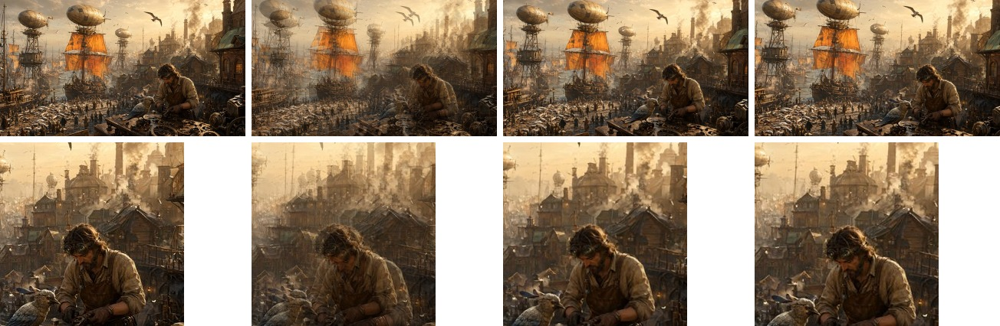

# RIFERunner

[RIFE 4.26](https://github.com/hzwer/Practical-RIFE) frame interpolation on
Lava: the frame at any `t` between two others. MIT.

## Interpolating

```julia
using RIFERunner

m = rife()
framesize(m)                          # (1920, 1152): the export's padded size
out = similar(a)
interpolate!(out, m, a, b; t = 0.5)   # a, b, out: (W, H) matrices of any AbstractRGB
release!(m)
```

Frames are host or device matrices indexed `[x, y]`, all the same size and no
larger than `framesize(m)`. They are zero-padded to the export's size and the
result is cropped back, never resized, so a smaller frame costs what a full one
does. For slow motion, call it at `t = 0.25, 0.5, 0.75`.

## Examples

A fast camera push-in, 12% closer and 2 degrees turned between the two frames:
[`docs/examples/rife.jl`](../docs/examples/rife.jl). The second row is the
mechanic at 1:1.



First frame, a cross-fade of the two, RIFE at `t = 0.5`, second frame. The
cross-fade shows both frames at once; RIFE moves the picture.

**0.26 s** a frame on a Radeon 8060S (RADV, 2026-09-30), at the padded
1920x1152. The output matches PyTorch to 3.3e-4 max and 4.9e-7 mean
(`tools/verify_rife.jl`).

## Assets

One artifact, `rife` (22 MB).
