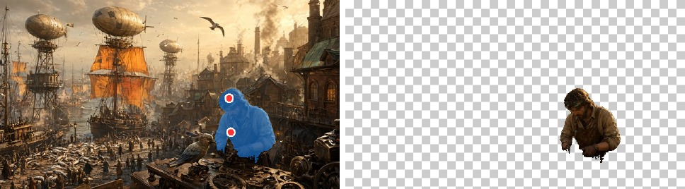
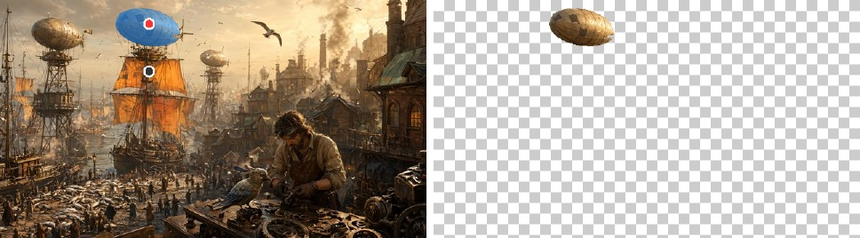

# SAM2Runner

[SAM 2.1](https://github.com/facebookresearch/sam2) (large) click-to-segment on
Lava: encode a frame once, then turn clicks into masks. Apache-2.0.

## Segmenting a picture

```julia
using SAM2Runner, FileIO

img  = permutedims(load("fox.jpg"))            # (W, H): the first index is x
mask = segment(img, [(0.5, 0.55)])             # one click, normalized, origin top-left
mask = segment(img, [(0.68, 0.7), (0.675, 0.52)])        # several on one object
mask = segment(img, [(0.35, 0.1), (0.35, 0.3, false)])   # `false` marks outside
```

`mask` is a `Matrix{UInt8}` of `size(img)`, `0xff` inside. Up to 16 points per
prompt. `segment(img, points; key = k)` reuses the image embedding for a second
prompt on the same frame, which skips the encoder. `unloadmodel!()` frees the
~900 MB of weights the shared model holds.

The lower level is `sam2model()`, `encode(m, image)` and
`segment(m, feats, points, labels)`, which return the 256x256 logits and the
predicted IoU instead of a resampled mask.

## Examples

Inputs are the [Qwen-Image](../QwenImageRunner/README.md) examples; the code is
[`docs/examples/sam2.jl`](../docs/examples/sam2.jl). Red dots are clicks on the
object, the grey one marks a point outside it.

<table>
<tr><td></td></tr>
<tr><td>One click on the chest.</td></tr>
<tr><td></td></tr>
<tr><td>Two clicks, body and face: one alone leaves holes in the hair.</td></tr>
<tr><td></td></tr>
<tr><td>The balloon in, its mast out.</td></tr>
</table>

A click on a new 640x640 frame, encoder included, takes **0.16 to 0.17 s** on a
Radeon 8060S (RADV, 2026-09-30). The first call in a process also builds the
model: about 15 s, most of it the weight upload and the graph passes.

## Assets

| artifact | size | |
|---|---|---|
| `sam2-large` | 943 MB | graphs and weights, downloaded on first use |
| `sam2-large-refs` | 1.2 GB | PyTorch activations for the layer-by-layer test only |

The test suite checks the encoder and decoder against PyTorch node by node.
One encoder node, `add_129`, is a pinned known mismatch; its band moved when
Lava started marking fp16 round trips `NoContraction` (see the comment in
`test/runtests.jl`).
